# 族谱管理系统 — 数据库课程实验报告

---

# 一、系统概述与架构设计

## 1.1 系统设计目标

本系统旨在构建一个支持多用户协作的族谱管理平台，实现对家族成员信息、血缘关系及婚姻关系的统一建模与高效查询。核心需求包括：

1. 支持多族谱并行管理（多租户模型）
2. 支持成员层级结构的动态扩展（深度不确定）
3. 支持祖先追溯与后代查询（递归查询）
4. 支持复杂亲缘关系路径分析（图最短路径问题）
5. 支持族谱数据的多格式导出（JSON、Graphviz DOT、SVG、Draw.io）
6. 在大规模数据（5万+成员）下具备可接受的查询性能

## 1.2 系统架构

系统采用 Django MTV（Model-Template-View）架构，结合三层分离设计：

```
表示层（Presentation Layer）
    └── Django Template + Bootstrap 5.3.3 + 自定义 CSS/JS

业务逻辑层（Application Layer）
    └── Django View（请求分发）+ Service（业务逻辑/SQL 查询）

数据层（Data Layer）
    └── MySQL 8.0 + PyMySQL 驱动
```

- **表示层**：6 个 HTML 模板（登录、成员管理、后代树、祖先树、统计仪表盘、分析查询），支持亮/暗主题切换，响应式布局
- **业务逻辑层**：`views.py`（1018 行）负责请求分发和权限校验；`services.py`（1058 行）封装所有 SQL 查询和树构建逻辑
- **数据层**：7 张业务表 + Django 系统表，通过 PyMySQL 驱动连接 MySQL

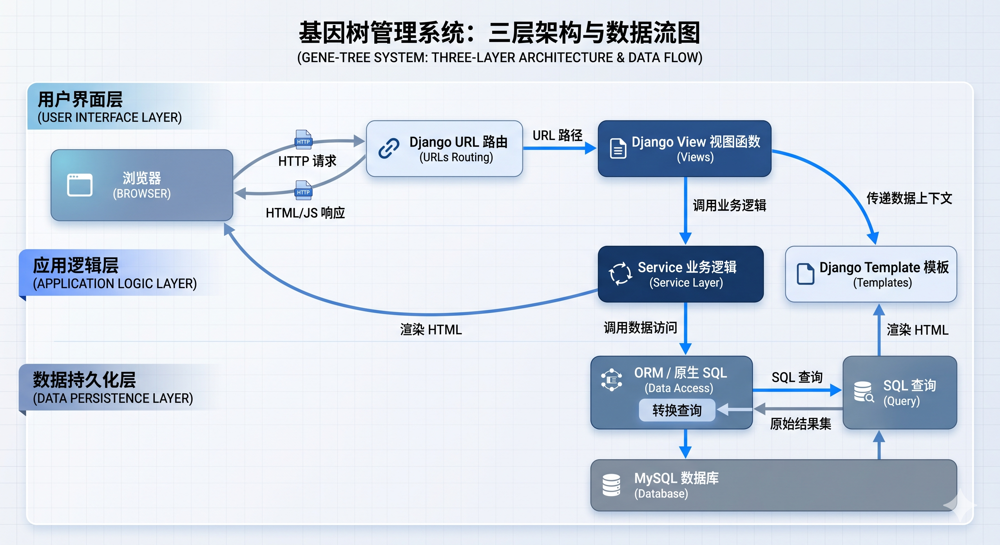
<p align="center"><em>图 1：系统架构与数据流图，展示表示层、业务逻辑层和数据层的三层分离设计及请求处理流程</em></p>

## 1.3 技术选型

| 技术 | 版本 | 选型理由 |
|------|------|---------|
| Django | 5.2.1 | ORM 抽象、Migration 数据库版本管理、内置用户认证与管理后台 |
| MySQL | 8.0+ | 支持递归 CTE（WITH RECURSIVE）、复合主键、CHECK 约束 |
| PyMySQL | 1.1.1 | 纯 Python MySQL 驱动，无需编译 C 扩展，跨平台兼容 |
| Bootstrap | 5.3.3 | 响应式 UI 框架，快速构建前端界面 |
| python-dotenv | 1.0.1 | 从 `.env` 文件加载环境变量，保护敏感信息 |

本系统未采用闭包表（Closure Table），而是采用**递归查询 + 索引优化 + 代际缓存表**的方式，在存储简洁性和查询性能之间取得平衡。

## 1.4 功能模块

| 模块 | 功能要点 |
|------|---------|
| 用户与权限 | 注册/登录（Session 认证）、owner/editor/viewer 三级角色、装饰器鉴权 |
| 族谱管理 | 创建族谱（自动绑定 owner）、邀请协作者（仅 owner，update_or_create 幂等） |
| 成员管理 | CRUD（POST-Redirect-GET 防重复提交）、姓名前缀搜索（B+Tree 索引） |
| 关系查询 | 祖先查询（Recursive CTE）、后代查询（递归 + 前端懒加载）、亲缘路径（BFS） |
| 数据分析 | 配偶子女（Q1）、代际寿命（Q3）、未婚男性（Q4）、早生成员（Q5） |
| 数据导出 | JSON / Graphviz DOT / SVG / Draw.io 四种格式 |
| 数据生成 | Python 脚本生成仿真族谱 CSV，SQL 脚本一键批量导入 |

## 1.5 REST API 设计

系统提供 19 个 RESTful API 端点，分为公开接口和需认证接口两类：

| # | 方法 | 路径 | 说明 | 权限 |
|---|------|------|------|------|
| 1 | POST | /register | 用户注册 | 公开 |
| 2 | POST | /login | 用户登录 | 公开 |
| 3 | GET/POST | /genealogies | 查询/创建族谱 | 登录 |
| 4 | POST | /genealogies/{id}/invite | 邀请协作者 | owner |
| 5 | GET/POST | /members | 查询/创建成员 | 登录 |
| 6 | GET/PUT/DELETE | /members/{id} | 成员详情/更新/删除 | 登录 |
| 7 | GET | /ancestors/{id} | 祖先查询 | 登录 |
| 8 | GET | /descendants/{id} | 后代查询 | 登录 |
| 9 | GET | /relationship?id1=&id2= | 亲缘路径（ORM BFS） | 登录 |
| 10 | GET | /relationship-sql?id1=&id2= | 亲缘路径（SQL BFS） | 登录 |
| 11 | GET | /analysis/spouse-children/{id} | 配偶与子女 | 登录 |
| 12 | GET | /analysis/longest-lifespan-generation | 最长寿代际 | 登录 |
| 13 | GET | /analysis/unmarried-male-over-50 | 未婚男性>50 | 登录 |
| 14 | GET | /analysis/early-born-members | 早生成员 | 登录 |
| 15 | GET | /tree/{id} | 后代树 JSON | 登录 |
| 16 | GET | /tree-children/{id} | 子节点（懒加载） | 登录 |
| 17 | GET | /ancestors-tree/{id} | 祖先树 JSON | 登录 |
| 18 | GET | /dashboard | 统计数据 | 登录 |
| 19 | GET | /genealogy-tree-download | 族谱导出（json/dot/svg/drawio） | 登录 |

权限模型：API 视图使用 `@api_login_required` 装饰器（未认证返回 401 JSON）；页面视图使用 `@login_required`（未认证重定向到登录页）。写操作需 owner/editor 角色，邀请操作仅 owner 可执行。

## 1.6 前端页面

| 页面 | 路径 | 功能 |
|------|------|------|
| 登录页 | /login-page | 用户登录表单 |
| 成员管理 | /members-page | 族谱选择、成员 CRUD、协作者邀请、姓名搜索 |
| 后代树 | /tree-page | 后代树形展示，AJAX 懒加载展开 |
| 祖先树 | /ancestors-tree-page | 祖先树形展示，父系蓝色/母系粉色分支 |
| 统计仪表盘 | /dashboard-page | 总人数、性别比例饼图、数据导出 |
| 分析查询 | /analysis-page | 6 种查询卡片，AJAX 动态渲染结果 |

前端技术：Bootstrap 5.3.3 + 自定义 CSS（1012 行，支持亮/暗主题）+ 自定义 JS（115 行，Toast 通知、主题切换）。后代树采用懒加载（点击展开时异步请求 `/tree-children/{id}`），祖先树在服务端构建完整树结构后前端直接渲染。

<table>
<tr>
<td align="center">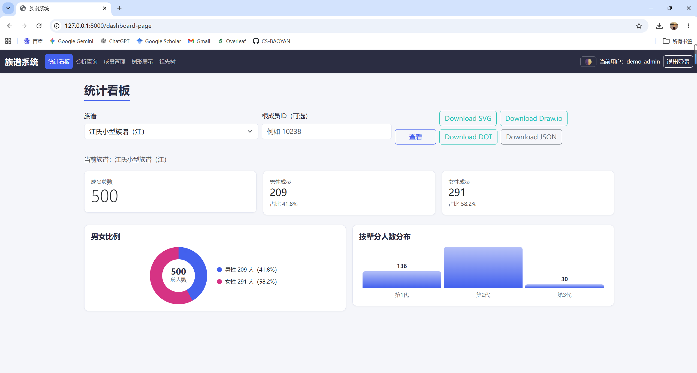<br/><b>图 2‑1 数据看板</b></td>
<td align="center">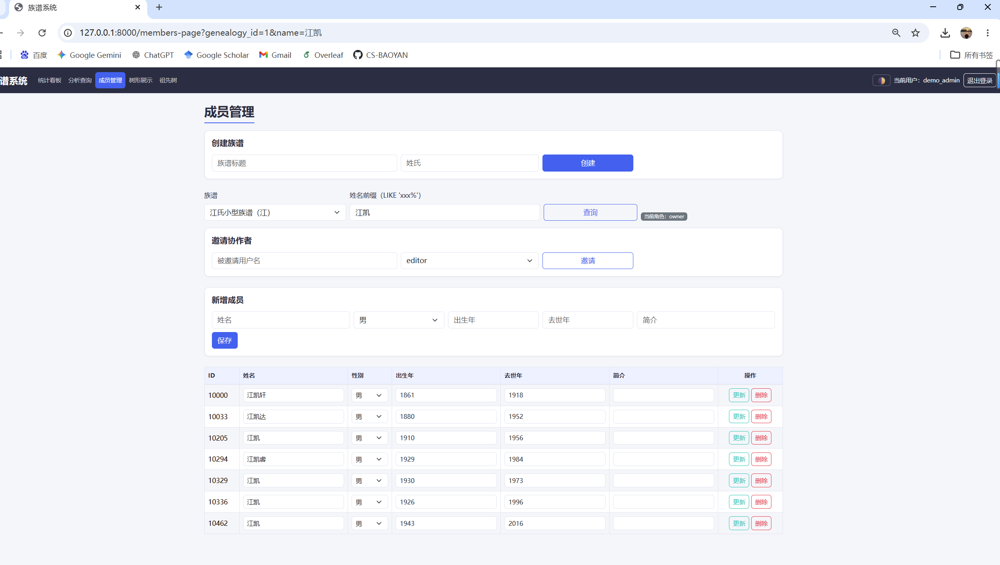<br/><b>图 2‑2 成员管理</b></td>
</tr>
<tr>
<td align="center">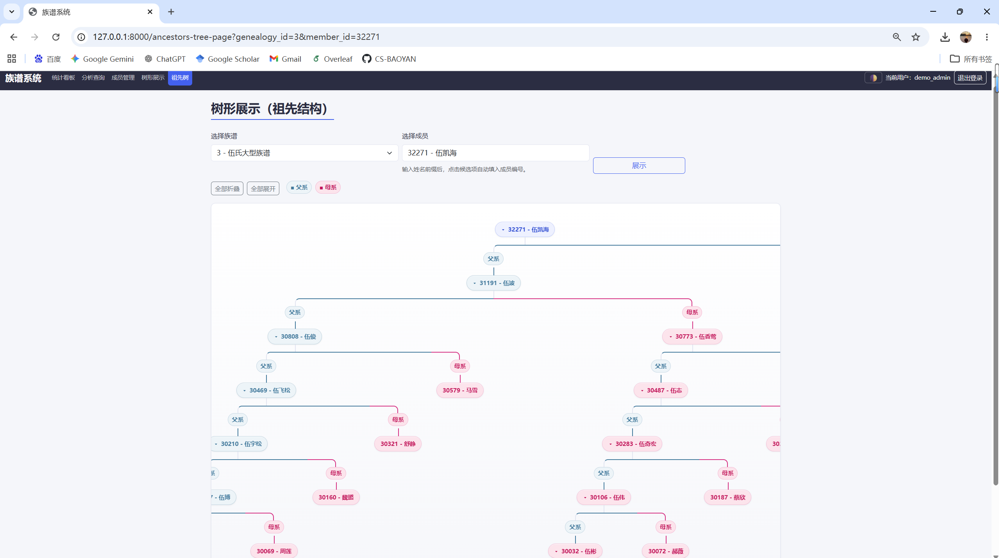<br/><b>图 2‑3 祖先树</b></td>
<td align="center">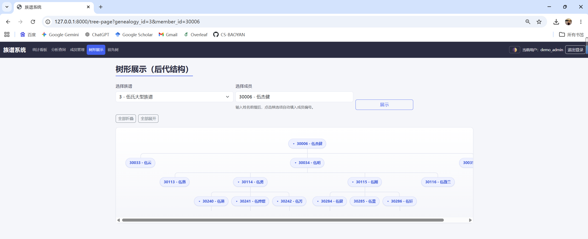<br/><b>图 2‑4 树形展示</b></td>
</tr>
<tr>
<td align="center">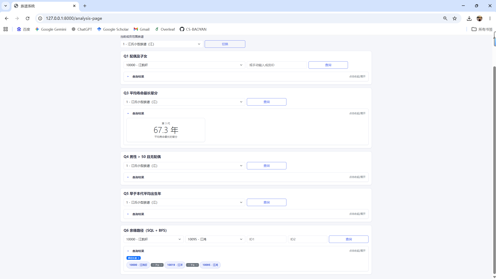<br/><b>图 2‑5 分析查询</b></td>
<td align="center">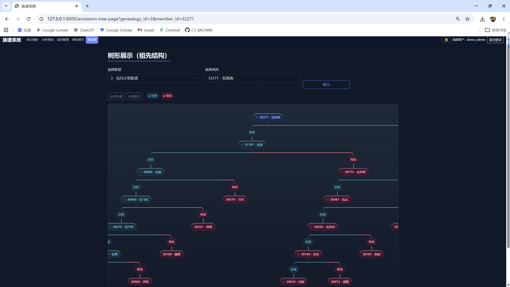<br/><b>图 2‑6 主题切换</b></td>
</tr>
</table>
<p align="center"><b>图 2：系统功能页面</b></p>

---

# 二、数据库设计：E-R 模型、规范化与物理实现

## 2.1 建模原则

族谱系统的核心问题是表达"人"与"关系"。建模遵循三个原则：

- **实体与关系分离**：成员信息（属性）与成员关系（结构）解耦，分别建表
- **基础关系最小化**：仅存储父母、婚姻两种基础关系，复杂关系（叔叔、堂兄弟等）通过查询推导
- **多对多关系显式建模**：所有 M:N 关系通过中间表表达

## 2.2 实体集设计

### User（用户）

继承 Django 的 `AbstractUser`，支持系统登录与权限控制。

| 属性 | 类型 | 约束 | 说明 |
|------|------|------|------|
| user_id | BIGINT | PK, AUTO_INCREMENT | 用户唯一标识 |
| username | VARCHAR(150) | UNIQUE, NOT NULL | 用户名 |
| password | VARCHAR(128) | NOT NULL | PBKDF2-SHA256 哈希 |
| email | VARCHAR(254) | UNIQUE, NOT NULL | 邮箱 |
| is_staff | BOOLEAN | DEFAULT FALSE | 是否管理员 |
| is_active | BOOLEAN | DEFAULT TRUE | 是否激活 |

函数依赖：`user_id → *`，`username → user_id`，`email → user_id`

### Genealogy（族谱）

| 属性 | 类型 | 约束 | 说明 |
|------|------|------|------|
| genealogy_id | BIGINT | PK, AUTO_INCREMENT | 族谱唯一标识 |
| title | VARCHAR(255) | NOT NULL | 族谱标题 |
| surname | VARCHAR(100) | NOT NULL | 姓氏 |
| created_at | DATETIME | NOT NULL, AUTO | 创建时间 |
| created_by_id | BIGINT | FK → user, CASCADE | 创建者 |

函数依赖：`genealogy_id → title, surname, created_at, created_by_id`

### Member（成员 — 核心实体）

| 属性 | 类型 | 约束 | 说明 |
|------|------|------|------|
| member_id | BIGINT | PK, AUTO_INCREMENT | 成员唯一标识 |
| genealogy_id | BIGINT | FK → genealogy, CASCADE | 所属族谱 |
| name | VARCHAR(100) | NOT NULL, INDEX | 姓名 |
| gender | CHAR(1) | NOT NULL, CHECK('M','F') | 性别 |
| birth_year | INT UNSIGNED | NULL | 出生年份 |
| death_year | INT UNSIGNED | NULL | 去世年份（NULL=在世） |
| biography | LONGTEXT | NOT NULL, DEFAULT '' | 生平简介 |

函数依赖：`member_id → genealogy_id, name, gender, birth_year, death_year, biography`

### MemberGenerationCache（代际缓存 — 性能优化实体）

该实体不属于核心 E-R 模型，而是**物理优化设计**。通过 BFS 预计算每个成员的代际编号，将 Q3/Q5 查询从 ~15s 降至 ~0.2s。

| 属性 | 类型 | 约束 | 说明 |
|------|------|------|------|
| member_id | BIGINT | PK, FK → member, CASCADE | 成员唯一标识 |
| genealogy_id | BIGINT | FK → genealogy, CASCADE | 所属族谱 |
| generation | INT UNSIGNED | NOT NULL | 代际编号（始祖=1） |
| computed_at | DATETIME | AUTO UPDATE | 缓存计算时间 |

函数依赖：`member_id → genealogy_id, generation, computed_at`

## 2.3 联系集设计

### 血缘关系（递归二元联系）

```
Member ── Parent_Child ── Member
```

一个成员可以有多个子女（1:N），一个成员最多有两个父母。采用**复合主键**建模：

| 属性 | 类型 | 约束 | 说明 |
|------|------|------|------|
| parent_id | BIGINT | PK(1/2), FK → member, CASCADE | 父/母 |
| child_id | BIGINT | PK(2/2), FK → member, CASCADE | 子女 |
| relation_type | VARCHAR(10) | NOT NULL, CHECK('father','mother') | 关系类型 |

约束：`PRIMARY KEY (parent_id, child_id)`，`CHECK (parent_id <> child_id)`

### 婚姻关系（M:N 联系实体化）

```
Member ── Marriage ── Member
```

一个人可能有多段婚姻（再婚），且婚姻关系具有属性（时间、状态），因此建模为独立联系实体：

| 属性 | 类型 | 约束 | 说明 |
|------|------|------|------|
| marriage_id | BIGINT | PK, AUTO_INCREMENT | 婚姻唯一标识 |
| spouse1_id | BIGINT | FK → member, CASCADE | 配偶1 |
| spouse2_id | BIGINT | FK → member, CASCADE | 配偶2 |
| start_date | DATE | NULL | 结婚日期 |
| end_date | DATE | NULL | 离婚日期 |
| status | VARCHAR(20) | DEFAULT 'active' | 状态（active/deceased） |

约束：`CHECK (spouse1_id <> spouse2_id)`

### 用户-族谱关系（M:N 联系）

```
User ── Genealogy_User ── Genealogy
```

多用户协作，关系带属性（role）：

| 属性 | 类型 | 约束 | 说明 |
|------|------|------|------|
| genealogy_user_id | BIGINT | PK, AUTO_INCREMENT | 关联唯一标识 |
| user_id | BIGINT | FK → user, CASCADE | 用户 |
| genealogy_id | BIGINT | FK → genealogy, CASCADE | 族谱 |
| role | VARCHAR(20) | DEFAULT 'viewer' | 角色（owner/editor/viewer） |

约束：`UNIQUE (user_id, genealogy_id)`

## 2.4 ER 图

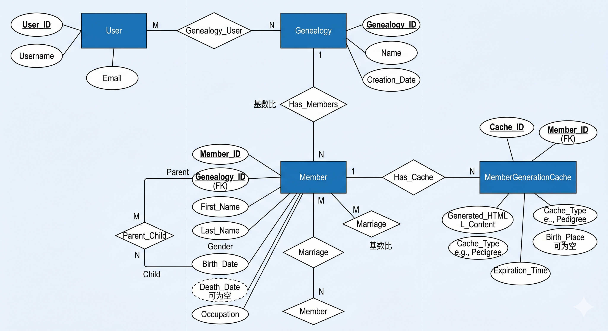
<p align="center"><em>图 3：系统 E-R 图，展示 User、Genealogy、Member、ParentChild、Marriage、GenealogyUser、MemberGenerationCache 等实体及其主外键联系</em></p>

图中实体与联系可以概括为：

| 联系 | 基数 | 实现方式 | 说明 |
|------|------|---------|------|
| User - Genealogy | 1:N | `genealogy.created_by_id` 外键 | 一个用户可以创建多个族谱 |
| Genealogy - Member | 1:N | `member.genealogy_id` 外键 | 一个族谱包含多个成员 |
| User - Genealogy | M:N | `genealogy_user` 中间表 | 支持 owner/editor/viewer 协作权限 |
| Member - ParentChild - Member | 递归 1:N | `parent_child(parent_id, child_id)` | 父母与子女关系，支持祖先/后代递归查询 |
| Member - Marriage - Member | M:N | `marriage(spouse1_id, spouse2_id)` | 支持多段婚姻，并保存婚姻时间和状态 |
| Member - MemberGenerationCache | 1:0..1 | `member_generation_cache.member_id` 主外键 | 每个成员最多一条代际缓存 |

E-R 到关系模式的转换结果如下：

```text
User(user_id, username, password, email, is_staff, is_active, ...)

Genealogy(genealogy_id, title, surname, created_at, created_by_id)
  FK created_by_id -> User(user_id)

Member(member_id, genealogy_id, name, gender, birth_year, death_year, biography)
  FK genealogy_id -> Genealogy(genealogy_id)

ParentChild(parent_id, child_id, relation_type)
  PK(parent_id, child_id)
  FK parent_id -> Member(member_id)
  FK child_id -> Member(member_id)

Marriage(marriage_id, spouse1_id, spouse2_id, start_date, end_date, status)
  FK spouse1_id -> Member(member_id)
  FK spouse2_id -> Member(member_id)

GenealogyUser(genealogy_user_id, user_id, genealogy_id, role)
  FK user_id -> User(user_id)
  FK genealogy_id -> Genealogy(genealogy_id)
  UNIQUE(user_id, genealogy_id)

MemberGenerationCache(member_id, genealogy_id, generation, computed_at)
  PK(member_id)
  FK member_id -> Member(member_id)
  FK genealogy_id -> Genealogy(genealogy_id)
```

其中 `ParentChild` 是自引用递归联系的实体化表，两个外键都指向 `member`；`Marriage` 和 `GenealogyUser` 是带属性的多对多联系实体化表；`MemberGenerationCache` 是物理优化表，逻辑上可由 `parent_child` 推导，删除后可以重新计算。

## 2.5 规范化推导

### 非规范化反例

若将所有信息存入一张表：

```
Member(member_id, name, gender, birth_year, father_name, mother_name, spouse_name, genealogy_title)
```

问题：数据冗余严重、无法表达多婚关系、更新/插入/删除异常。

### 函数依赖分析

| 表 | 函数依赖 |
|----|---------|
| member | member_id → name, gender, birth_year, death_year, biography, genealogy_id |
| parent_child | (parent_id, child_id) → relation_type |
| marriage | marriage_id → spouse1_id, spouse2_id, start_date, end_date, status |
| genealogy | genealogy_id → title, surname, created_at, created_by_id |
| genealogy_user | (user_id, genealogy_id) → role |

### 逐范式推导

**1NF**：属性原子化，无重复组 → 将父子关系、婚姻关系拆分为独立表。

**2NF**：消除部分依赖 → `parent_child(parent_id, child_id) → relation_type` 中，relation_type 完全依赖于复合主键，无部分依赖。

**3NF**：消除传递依赖 → `member_id → genealogy_id → surname` 存在传递依赖，拆分为 member 表（不含 surname）和 genealogy 表（含 surname）。

**BCNF**：所有决定因素为超键 → 验证所有表的 FD，member_id、genealogy_id、marriage_id、(parent_id, child_id)、(user_id, genealogy_id) 均为主键或候选键。

**结论**：所有表达到 **BCNF**。在此基础上引入 `member_generation_cache` 缓存表属于物理层反规范化，不影响逻辑层规范化结论。

## 2.6 物理设计

### 存储引擎与字符集

`ENGINE=InnoDB DEFAULT CHARSET=utf8mb4` — InnoDB 支持事务、外键、行级锁；utf8mb4 完整支持中文。

### 索引设计

| 表 | 索引 | 类型 | 列 | 用途 |
|----|------|------|----|------|
| member | idx_member_name | B-tree | name | 姓名精确/前缀搜索 |
| member | idx_member_name_prefix | 前缀索引 | name(10) | 减少索引体积，加速前缀搜索 |
| parent_child | idx_parent | B-tree | parent_id | 给定父亲找子女（后代查询） |
| parent_child | idx_child | B-tree | child_id | 给定子女找父亲（祖先查询） |
| parent_child | idx_parent_child | 组合索引 | (parent_id, child_id) | 覆盖索引，避免回表 |
| member_generation_cache | idx_mgc_genealogy_generation | 组合索引 | (genealogy_id, generation) | 按族谱+代际查询 |

索引设计说明：
- **双向索引**：`idx_parent` 和 `idx_child` 方向相反，覆盖递归 CTE 的两个方向（祖先向上、后代向下）
- **前缀索引 name(10)**：中文姓名 2-4 字（6-12 字节），取前 10 字符在索引体积和区分度间取得平衡
- **覆盖索引 (parent_id, child_id)**：查询只需这两列时，直接从索引返回，无需回表

### 约束设计

| 表 | 约束 | 内容 |
|----|------|------|
| member | CHECK | gender IN ('M', 'F') |
| parent_child | CHECK | relation_type IN ('father', 'mother') |
| parent_child | CHECK | parent_id <> child_id |
| marriage | CHECK | spouse1_id <> spouse2_id |
| genealogy_user | UNIQUE | (user_id, genealogy_id) |

### 跨行/跨表业务约束（为什么不直接用 CHECK）

除上述“单行可判定”的约束外，族谱场景还存在一些**跨行/跨表**的业务规则，例如：

- **父母出生年份早于子女**：`member.birth_year(parent) < member.birth_year(child)`（两者可能为 NULL）
- **多租户隔离**：parent 与 child 必须属于同一族谱（`member.genealogy_id(parent) = member.genealogy_id(child)`）
- **父/母唯一性**：同一个 child 最多一个 father、一个 mother（可等价为 `UNIQUE(child_id, relation_type)`）
- （可选）**性别与 relation_type 一致**：father 对应 `gender='M'`、mother 对应 `gender='F'`

这些规则的共同点是：需要读取同表的另一行或另一张表的数据（例如在插入 `parent_child` 时要查 `member` 表中的 birth_year/genealogy_id/gender）。

在 SQL 标准语义中，`CHECK` 约束只对“当前行”表达式做判定；在 MySQL 8 中也不支持在 `CHECK` 中引用其他表/子查询来完成上述跨表校验。因此它们通常不适合以 `CHECK` 直接落地。

工程上通常有两种落地方式（可按课程答辩需要说明取舍）：

1) **应用层校验（推荐作为主方案）**：在 Django 的 View/Service 层进行校验后再写入（尤其当关系编辑入口主要在应用侧时）。本项目中 `parent_child` / `marriage` 关系主要由数据生成脚本与批量导入产生，生成规则已在导入前保证数据一致性；若将来开放“在线编辑父母/婚姻关系”，即可在写入前增加这些校验。

2) **数据库触发器/唯一约束（Defense in depth）**：在 MySQL 侧加 `UNIQUE(child_id, relation_type)` 等结构性约束；对“出生年份先后/同族谱/性别匹配”等跨表规则，可用 `BEFORE INSERT/UPDATE` 触发器查询 `member` 并用 `SIGNAL` 拒绝不合法写入。触发器的代价是：实现复杂、调试成本更高，并会对批量导入吞吐产生一定影响（但能保证任何写入路径都遵守规则）。

例如“父母出生年份早于子女”无法仅靠普通 `CHECK` 跨表判断，可用触发器表达：

```sql
DELIMITER //

CREATE TRIGGER trg_parent_birth_before_child
BEFORE INSERT ON parent_child
FOR EACH ROW
BEGIN
    DECLARE parent_birth INT;
    DECLARE child_birth INT;

    SELECT birth_year INTO parent_birth
    FROM member
    WHERE member_id = NEW.parent_id;

    SELECT birth_year INTO child_birth
    FROM member
    WHERE member_id = NEW.child_id;

    IF parent_birth IS NOT NULL
       AND child_birth IS NOT NULL
       AND parent_birth >= child_birth THEN
        SIGNAL SQLSTATE '45000'
            SET MESSAGE_TEXT = 'parent birth_year must be earlier than child birth_year';
    END IF;
END//

DELIMITER ;
```

### 外键策略

所有外键均使用 `ON DELETE CASCADE`：删除族谱 → 自动删除所有成员、关系、缓存；删除成员 → 自动删除涉及该成员的所有关系。

---

# 三、SQL 查询设计与执行分析

## 3.1 查询执行方式

本系统中 SQL 通过两种方式执行：

**Django ORM**（简单 CRUD）：
```python
members = Member.objects.filter(genealogy_id=genealogy_id)
members = Member.objects.filter(name__startswith="张")  # 利用 B+Tree 索引
```

**原生 SQL + cursor.execute**（复杂查询）：
```python
with connection.cursor() as cursor:
    cursor.execute("WITH RECURSIVE ancestors AS (...) SELECT * FROM ancestors", [member_id])
```

使用原生 SQL 的原因：递归 CTE、UNION ALL 等高级 SQL 特性在 Django ORM 中支持有限，直接写 SQL 更清晰高效。

## 3.2 核心查询详解

### Q1：配偶与子女查询

给定成员 ID，查询其所有配偶及子女。采用 `UNION ALL` 两段等值连接替代初版的 `OR` 条件（后者导致 MySQL 无法走索引）：

```sql
SELECT relation, member_id, name, gender, birth_year, death_year
FROM (
    SELECT 'spouse' AS relation, m.*
    FROM marriage ma JOIN member m ON m.member_id = ma.spouse2_id
    WHERE ma.spouse1_id = %s
    UNION ALL
    SELECT 'spouse' AS relation, m.*
    FROM marriage ma JOIN member m ON m.member_id = ma.spouse1_id
    WHERE ma.spouse2_id = %s
    UNION ALL
    SELECT 'child' AS relation, c.*
    FROM parent_child pc JOIN member c ON c.member_id = pc.child_id
    WHERE pc.parent_id = %s
) t ORDER BY relation, member_id;
```

### Q2：祖先递归查询

使用 Recursive CTE 向上追溯所有历代祖先。`idx_child` 索引确保每次递归的连接操作能快速定位：

```sql
WITH RECURSIVE ancestors AS (
    SELECT pc.parent_id AS member_id, pc.child_id, pc.relation_type, 1 AS depth
    FROM parent_child pc WHERE pc.child_id = %s          -- 锚点：直接父母
    UNION ALL
    SELECT pc.parent_id, pc.child_id, pc.relation_type, a.depth + 1
    FROM parent_child pc JOIN ancestors a ON pc.child_id = a.member_id  -- 递归：父母的父母
)
SELECT DISTINCT a.member_id, m.name, a.depth
FROM ancestors a JOIN member m ON m.member_id = a.member_id
ORDER BY a.depth ASC, a.member_id ASC;
```

执行过程示例（从 member_id=1005 开始）：
```
Step 1（锚点）：child_id=1005 → parent_id=1003, 1004
Step 2（递归）：child_id=1003 → parent_id=1001
               child_id=1004 → 无记录
Step 3（递归）：child_id=1001 → 无记录 → 终止
```

### Q3：代际平均寿命分析

统计平均寿命最长的一代人。初版每次递归 CTE 重算代际（~14.8s），优化后使用代际缓存表（后续~0.16s）：

```sql
WITH generation_lifespan AS (
    SELECT mgc.generation,
           AVG(COALESCE(m.death_year, YEAR(CURDATE())) - m.birth_year) AS avg_lifespan
    FROM member_generation_cache mgc
    JOIN member m ON m.member_id = mgc.member_id
    WHERE mgc.genealogy_id = %s AND m.birth_year IS NOT NULL
    GROUP BY mgc.generation
)
SELECT generation, avg_lifespan
FROM generation_lifespan ORDER BY avg_lifespan DESC LIMIT 1;
```

代际缓存通过 BFS 构建：从入度为 0 的根节点（始祖，generation=1）开始，子节点 generation = 父节点 + 1，多父母取较小值。

### Q4：未婚男性统计

查询年龄超过 50 岁且无配偶的男性。初版用 `OR` 条件 LEFT JOIN（~121.8s），优化后用 CTE + anti-join（~0.26s）：

```sql
WITH married AS (
    SELECT spouse1_id AS member_id FROM marriage
    UNION SELECT spouse2_id AS member_id FROM marriage
)
SELECT m.member_id, m.name, m.gender, m.birth_year,
       (YEAR(CURDATE()) - m.birth_year) AS age
FROM member m
LEFT JOIN married mr ON mr.member_id = m.member_id
WHERE m.genealogy_id = %s AND m.gender = 'M'
  AND m.birth_year IS NOT NULL
  AND (YEAR(CURDATE()) - m.birth_year) > 50
  AND mr.member_id IS NULL               -- anti-join：排除已婚
ORDER BY age DESC, m.member_id;
```

### Q5：早生成员查询

找出出生年份早于该辈分平均出生年份的成员，使用代际缓存表加速：

```sql
WITH generation_avg_birth AS (
    SELECT mgc.generation, AVG(m.birth_year) AS avg_birth_year
    FROM member_generation_cache mgc
    JOIN member m ON m.member_id = mgc.member_id
    WHERE mgc.genealogy_id = %s AND m.birth_year IS NOT NULL
    GROUP BY mgc.generation
)
SELECT m.member_id, m.name, mgc.generation, m.birth_year, gab.avg_birth_year
FROM member_generation_cache mgc
JOIN member m ON m.member_id = mgc.member_id
JOIN generation_avg_birth gab ON gab.generation = mgc.generation
WHERE mgc.genealogy_id = %s AND m.birth_year IS NOT NULL
  AND m.birth_year < gab.avg_birth_year
ORDER BY mgc.generation, m.birth_year, m.member_id;
```

### Q6：亲缘路径查询（BFS 最短路径）

将族谱视为无向图（节点=成员，边=父子/婚姻，均双向），通过 SQL 构建边集合，应用层 BFS 求最短路径：

```sql
-- Step A：构建无向边集合
SELECT parent_id AS node_a, child_id AS node_b, 'child' AS edge_type FROM parent_child
UNION ALL SELECT child_id, parent_id, 'parent' FROM parent_child
UNION ALL SELECT spouse1_id, spouse2_id, 'spouse' FROM marriage
UNION ALL SELECT spouse2_id, spouse1_id, 'spouse' FROM marriage;

-- Step B：应用层 BFS（Python）
-- queue = deque([start_id])
-- 逐层扩展，prev 记录前驱节点和边类型
-- 到达 target 后回溯路径
```

提供两种实现：`shortest_relationship_path`（ORM 加载边）和 `shortest_relationship_path_sql_bfs`（原生 SQL 加载边）。

## 3.3 索引对查询执行的影响

以 `SELECT child_id FROM parent_child WHERE parent_id = 100` 为例：

| 情况 | EXPLAIN type | 扫描行数 | 时间复杂度 | 说明 |
|------|-------------|---------|-----------|------|
| 无索引 | ALL | N（全表） | O(N) | 全表扫描 |
| idx_parent | ref | K（匹配行） | O(logN+K) | B+Tree 定位 |
| idx_parent_child | ref + Using index | K | O(logN+K) | 覆盖索引，无需回表 |

选择 B+Tree 而非 Hash 索引的原因：族谱系统需要范围查询（`birth_year > 1950`）和前缀匹配（`name LIKE '张%'`），Hash 索引不支持这些操作。

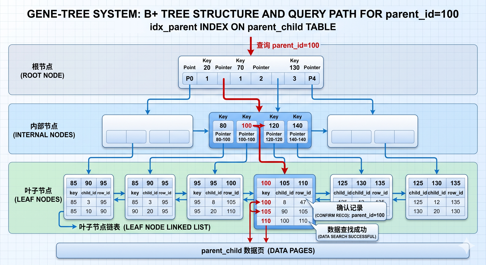
<p align="center"><em>图 4：B+Tree 索引结构示意图，展示如何通过索引快速定位 parent_id 或 child_id 对应的记录</em></p>

## 3.4 性能优化

### 问题识别

| 查询 | 优化前耗时 | 瓶颈原因 |
|------|-----------|---------|
| /analysis-page | ~3.4s / 17.98MB | 一次性加载全量成员到下拉框 |
| Q3 最长寿代际 | ~14.8s | 每次递归 CTE 重算代际 |
| Q4 未婚男性>50 | ~121.8s | OR 条件 LEFT JOIN 无法走索引 |
| Q5 早生成员 | ~14.7s | 每次递归 CTE 重算代际 |

### 优化方案

**代际缓存表**：新增 `member_generation_cache`，BFS 预计算代际编号。惰性重建策略——比较 member 表与 cache 表记录数，不一致时触发重建。

**SQL 改写**：Q1 配偶查询和 Q4 未婚统计均将 `OR` 条件改写为 `UNION ALL` 等值连接 + anti-join，使 MySQL 能高效使用索引。

**页面策略**：分析页只加载当前族谱成员，下拉限制 500 条，提供手动输入 member_id 备选。

### 优化效果

| 指标 | 优化前 | 优化后 | 提升 |
|------|--------|--------|------|
| /analysis-page | ~3390ms / 17.98MB | ~55ms / 176KB | **61x** |
| Q3 最长寿代际 | ~14.8s | 首次~2.5s，后续~0.16s | **92x** |
| Q4 未婚男性>50 | ~121.8s | ~0.26s | **468x** |
| Q5 早生成员 | ~14.7s | ~0.50s | **29x** |

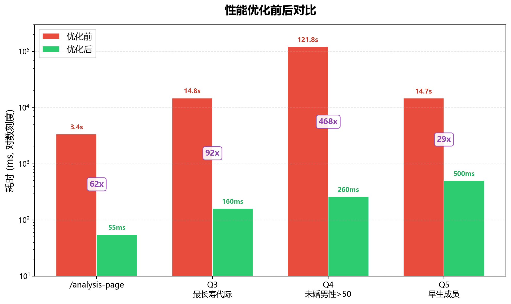
<p align="center"><em>图 5：性能优化前后对比柱状图，展示 Q3/Q4/Q5 查询及 /analysis-page 接口在优化前后的耗时变化</em></p>

---

# 四、数据生成与导入

## 4.1 Python 数据生成脚本

### 核心生成器 `generate_family_csv.py`（411 行）

模拟中国家族从始祖繁衍至今的完整过程，使用确定性随机种子保证可复现。

**姓名生成**：姓氏池 100 个 + 男性名池 50 字 + 女性名池 50 字，名字 = 姓 + 随机 1~2 个字。

**繁殖规则**：每代从活跃成员中选男女配对，条件为男性 22~60 岁、女性 20~55 岁、年龄差 ≤ 10 岁、3 代以内无血缘关系（祖先追溯检查）。每对夫妇生 1~4 个孩子。

**死亡概率模型**（基于 2026 年的年龄）：

| 年龄 | ≤30 | ≤50 | ≤70 | ≤85 | >85 |
|------|-----|-----|-----|-----|-----|
| 存活概率 | 98% | 90% | 50% | 15% | 2% |

**输出文件**：每个数据集生成 `member.csv`、`parent_child.csv`、`marriage.csv` 三个 CSV 文件。

### 编排脚本 `generate_all.py`

| 数据集 | genealogy_id | member_id 起始 | 目标人数 | 随机种子 | 起始年份 | 始祖数 |
|--------|-------------|---------------|---------|---------|---------|-------|
| small  | 1           | 10000         | 500     | 42      | 1860    | 8     |
| medium | 2           | 20000         | 5,000   | 2026    | 1720    | 10    |
| large  | 3           | 30000         | 50,000  | 20260108| 1600    | 12    |

member_id 范围不重叠，三个数据集可共存于同一数据库。

## 4.2 SQL 批量导入

导入流程：

```
1. python manage.py migrate                          → 建表
2. mysql -u root -p gene_tree < sql/init.sql         → 创建 2 个演示用户
3. mysql -u root -p --local-infile=1 gene_tree < sql/import_generated.sql  → 批量导入
```

`import_generated.sql` 的关键步骤：

1. **清空旧数据**：`TRUNCATE TABLE` 清空 parent_child、marriage、member、genealogy_user、genealogy（保留 user 表），临时禁用外键检查避免顺序问题
2. **创建族谱记录**：INSERT 3 个族谱（江氏/朱氏/伍氏），绑定 demo_admin 为 owner、demo_editor 为 editor
3. **LOAD DATA 批量导入**：9 次 `LOAD DATA LOCAL INFILE`（3 数据集 × 3 表），使用 `NULLIF(@death_year, '')` 处理空值，`LOWER(TRIM(@relation_type))` 规范化数据
4. **验证汇总**：SELECT COUNT(*) 确认导入结果

`LOAD DATA LOCAL INFILE` 是 MySQL 的高速批量导入命令，比逐条 INSERT 快 10-100 倍。

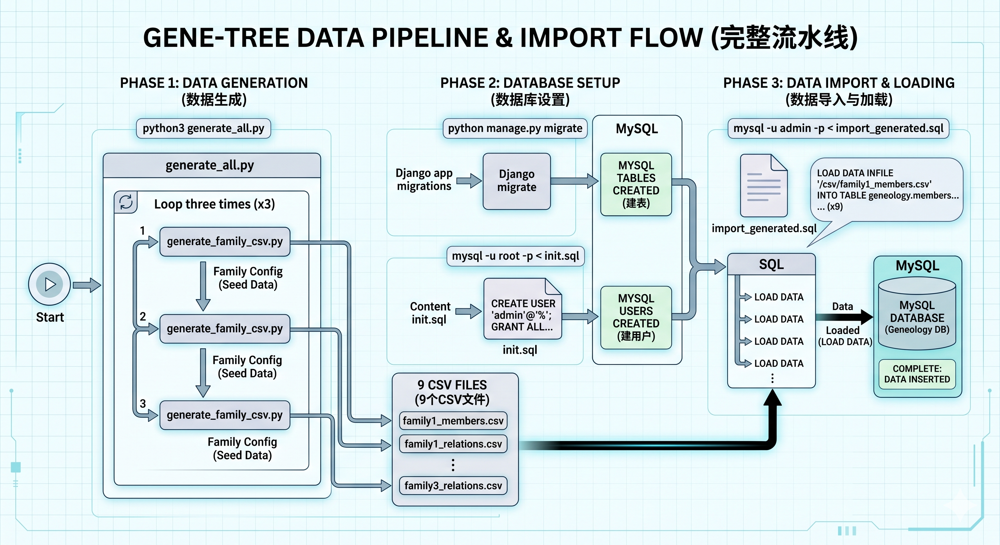
<p align="center"><em>图 6：数据生成与导入流程图，展示从 Python 脚本生成 CSV 到 SQL 批量导入 MySQL 的完整流水线</em></p>

---

# 五、Django 与数据库的交互机制

## 5.1 ORM 与 Migration

Django 的核心价值之一是 **Migration 系统**——数据库版本管理工具。开发者在 `models.py` 中用 Python 类定义表结构，Django 自动生成 SQL 并执行。

`python manage.py migrate` 的执行过程：

```
models.py（Python 类定义表结构）
    ↓ makemigrations
迁移文件（如 0001_initial.py，记录"这次改了什么"）
    ↓ migrate
SQL 执行（翻译成 CREATE TABLE / ALTER TABLE 等 SQL 并在 MySQL 上执行）
    ↓
django_migrations 表（记录已执行的迁移，保证幂等性）
```

本项目的迁移文件：
- **0001_initial.py**：创建 User、Genealogy、GenealogyUser、Member、ParentChild、Marriage 共 6 张表 + 索引 + 约束
- **0002_membergenerationcache.py**：新增 MemberGenerationCache 缓存表

## 5.2 模型定义示例

以 Member 为例，展示 Python 模型类如何映射到 MySQL 表：

```python
# models.py 中的 Python 类
class Member(models.Model):
    member_id = models.BigAutoField(primary_key=True)      # → BIGINT AUTO_INCREMENT PRIMARY KEY
    genealogy = models.ForeignKey(Genealogy, on_delete=models.CASCADE)  # → BIGINT FK + ON DELETE CASCADE
    name = models.CharField(max_length=100, db_index=True)  # → VARCHAR(100) + INDEX
    gender = models.CharField(max_length=1, choices=[('M','Male'),('F','Female')])  # → VARCHAR(1) + CHECK
    birth_year = models.PositiveIntegerField(null=True)      # → INT UNSIGNED NULL
    death_year = models.PositiveIntegerField(null=True)
    biography = models.TextField(blank=True, default="")     # → LONGTEXT

    class Meta:
        db_table = "member"
        indexes = [models.Index(fields=["name"], name="idx_member_name")]
```

Django 自动将这个类翻译为对应的 `CREATE TABLE` SQL 语句，包括字段类型、约束、索引和外键。

---

# 六、设计总结

## 6.1 关键设计思想

- **关系最小化**：只存父母 + 婚姻两种基础关系，复杂关系（叔叔、堂兄弟）通过查询推导
- **递归建模**：自引用关系 + Recursive CTE 表达无限层级
- **缓存优化**：对频繁查询的递归结果引入缓存表，惰性重建
- **索引双向覆盖**：parent_child 表同时建 parent 和 child 索引，覆盖两个查询方向

## 6.2 理论与工程的平衡

| 维度 | 理论要求 | 工程实践 |
|------|---------|---------|
| 规范化 | BCNF，无冗余 | 代际缓存表（物理层反规范化） |
| 查询 | Recursive CTE | 代际缓存 + CTE 按需使用 |
| 索引 | B+Tree 理论 | 双向索引 + 前缀索引 + 覆盖索引 |
| 连接 | 标准 JOIN | UNION ALL 替代 OR 条件（性能提升 468x） |

## 6.3 设计方案对比

本系统选择"递归 CTE + 代际缓存表"方案，与其他方案对比如下：

| 方案 | 查询性能 | 存储开销 | 维护复杂度 | 适用场景 |
|------|---------|---------|-----------|---------|
| 闭包表 | O(1) | O(N²) | 高 | 频繁查询、数据量可控 |
| 纯 CTE 递归 | O(深度) | O(N) | 低 | 查询频率低 |
| **CTE + 缓存表** | **O(1)** | **O(N)** | **中** | **查询频繁、数据量大** |

选择理由：课程项目中数据量可控，优先设计简洁性；通过缓存表弥补 CTE 的性能不足，同时保持存储结构的简洁。

## 6.4 答辩追问要点

| 可能问题 | 回答要点 |
|---------|---------|
| 为什么不在 `member` 表直接存 `father_id`、`mother_id`、`spouse_id`？ | 父母和婚姻是关系结构，不是成员自身的简单属性。拆成 `parent_child` 和 `marriage` 后，可以统一递归查询、支持多子女和多段婚姻，也避免字段重复。 |
| 递归 CTE 会不会无限循环？ | 正常族谱数据应是无环的；数据库已约束 `parent_id <> child_id` 防止直接自环。若要进一步增强，可在插入亲子关系前检查是否形成祖先环，或在 CTE 中维护路径字段并限制递归深度。 |
| 为什么没有使用闭包表？ | 闭包表祖先查询快，但需要保存所有祖先-后代路径，存储和维护成本高。本项目采用 `parent_child` 保存最小事实关系，用 Recursive CTE 查询，再用代际缓存优化高频统计。 |
| `member_generation_cache` 是否违反范式？ | 它是物理层派生缓存，不是核心事实数据。核心表满足 BCNF；缓存表可以删除并由 `parent_child` 重新计算，目的是降低 Q3/Q5 的重复递归成本。 |
| 为什么 Q4 用 `LEFT JOIN ... IS NULL`？ | 先用 CTE 汇总所有已婚成员，再用反连接筛出不在已婚集合中的男性成员，逻辑清晰，也避免 `OR` 条件导致 MySQL 难以使用索引。 |
| 出生年份为空如何处理？ | 年龄、寿命和平均出生年份查询都显式加 `birth_year IS NOT NULL`，避免空值参与计算导致统计语义不清。 |
